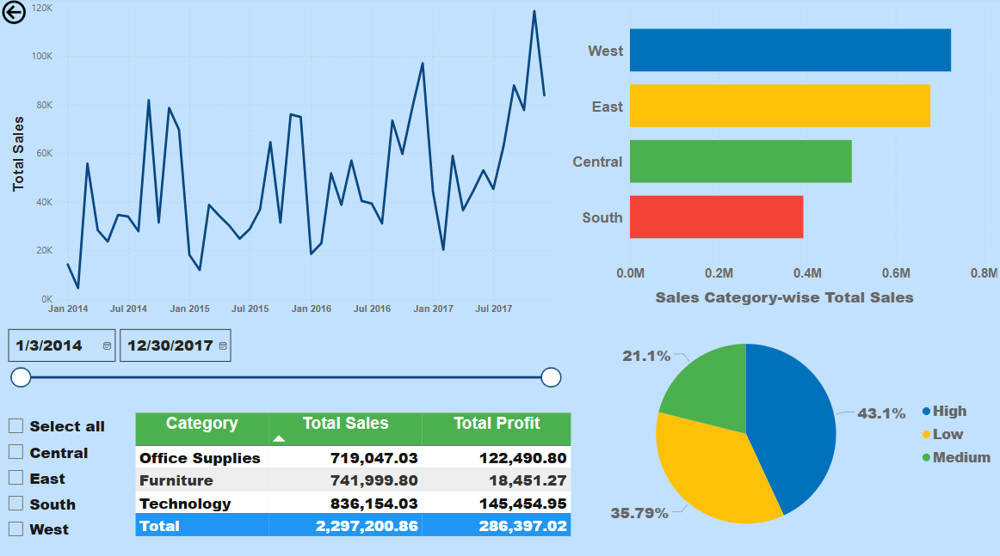
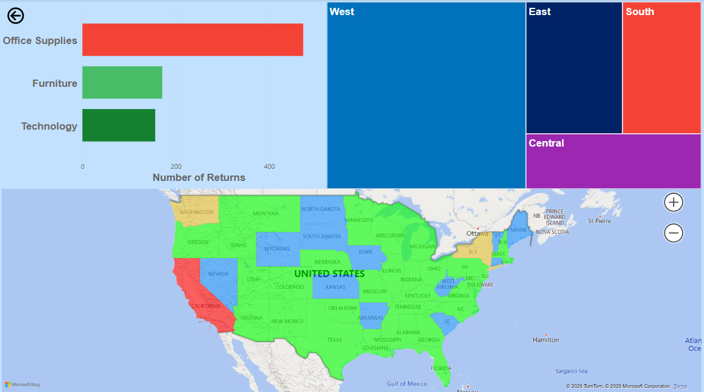

# **Superstore Data Analysis**

## **Overview**
This project analyzes Superstore sales and returns data to derive actionable insights for improving business performance. Using Power BI, the project focuses on visualizing trends, identifying areas of improvement, and providing interactive dashboards for decision-making.

---

## **Key Features**
- **Sales Analysis:** Understand performance across regions, product categories, and time periods.
- **Return Analysis:** Highlight trends and patterns in returned products to identify potential causes and solutions.
- **Interactive Dashboard:** Built in Power BI, enabling dynamic exploration of data for actionable insights.
- **Data-Driven Insights:** Comprehensive visualizations for decision support in key business areas.

---

## **Technologies Used**
- **Power BI:** For data visualization and interactive dashboards.
- **Data Processing Tools:** Excel, CSV for raw data management.
- **Analysis Techniques:** Descriptive analytics and trend analysis.

---

## **Project Structure**
- **`Superstore Data Analysis.pptx`:** Presentation summarizing key findings and dashboards.
- **Power BI Dashboard:** Accessible via Power BI to explore the data interactively.

---

## **Setup Instructions**

### **1. Clone the Repository**
```bash
git clone https://github.com/YashRaythatha/Superstore-Data-Analysis-using-PowerBI.git
cd Superstore-Data-Analysis-using-PowerBI
```

### **2. Open the Power BI File**
1. Ensure Power BI Desktop is installed on your system.
2. Open the provided `.pbix` file in Power BI Desktop.

---

## **Results**

### **Key Insights**
- **Sales Trends:** Identify regions and product categories driving revenue.
- **Return Patterns:** Uncover factors contributing to high return rates and potential operational inefficiencies.

### **Screenshots**



---

## **Future Enhancements**
- Incorporate machine learning models to predict returns and recommend actions.
- Automate data refresh for real-time dashboards.
- Expand analysis to include customer segmentation and lifetime value prediction.

---
